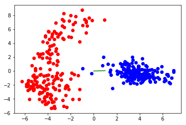
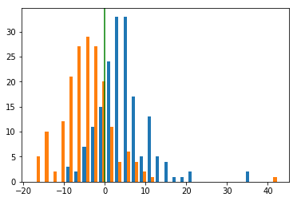

Image: http://cdn1.thr.com/sites/default/files/2016/11/westworld_s01e10_still_2.jpg
Summary: And in their triumph die, like fire and powder, Which, as they kiss, consume. The sweetest honey Is loathsome in his own deliciousness And in the taste confounds the appetite. Therefore love moderately. Long love doth so. Too swift arrives as tardy as too slow.
Author: Joshua Howard
Date: June 10th, 2021

```python
import numpy as np
from matplotlib import pyplot as plt
%matplotlib inline
import sklearn.datasets
```

$$L(x) = f(x)$$

# Data
* We begin with some dataset which exists in `d` dimensions, and is generally seperable (perhaps in `>=d` dimensions). 
* Data is therefore sampled from some multimodal probability distribution. 
* I will look at the mnist dataset, selecting 2 classes at random for a binary classification task. 
* I will scale this data to zero mean and unit variance. 


```python
X, y = sklearn.datasets.load_digits(2, return_X_y=True)
```


```python
from sklearn.preprocessing import StandardScaler
scaler = StandardScaler()
X = scaler.fit_transform(X)
print(X.mean())
print(X.std())
```

    -4.93432455389e-18
    0.901387818866


## Lets plot with PCA to see what these two classes look like


```python
from sklearn.decomposition import PCA
pca = PCA(n_components=2,)
XPCA = pca.fit_transform(X)
plt.plot(XPCA[y==0,0], XPCA[y==0,1],'bo')
plt.plot(XPCA[y==1,0], XPCA[y==1,1],'ro')
```


    [<matplotlib.lines.Line2D at 0x11d099748>]


# Single Neuron
* Lets look at how a single neuron would work. 
* Essentially, it selects a random vector from a `d` dimensional, spherical, normal distribution. 
* It then projects the data onto this vector. 
* Here I plot this vector from the origin (green line) on our PCA projection. 


```python
B = np.random.normal(size=(X.shape[1],1))
```


```python
BPCA = pca.transform(B.T)
BPCA = BPCA / np.linalg.norm(BPCA)
plt.plot(XPCA[y==0,0], XPCA[y==0,1],'bo')
plt.plot(XPCA[y==1,0], XPCA[y==1,1],'ro')
plt.plot([0.0, BPCA[0,0]], [0.0, BPCA[0,1]],'g')
```


    [<matplotlib.lines.Line2D at 0x11dc746d8>]





## And here, I plot the distributions of the resulting projections from each class. 
* Notice that it is pretty unlikely that such a random projection will result in evenly balanced populations of both classes on either side of zero (can we make this more rigorous?). 
* I have highlighted zero with a vertical green line. If we applied a ReLU, only the right side of the output would be sent forward. 
* I would imagine that training would then encourage "good" random projections to further separate the classes, and also learn to ignore bad projections. 


```python
X1 = X[y==0]
X2 = X[y==1]
Y1 = X1.dot(B)
Y2 = X2.dot(B)
```


```python
plt.hist([Y1,Y2], bins=30, histtype='bar');
plt.axvline(0.0,color='g')
```


    <matplotlib.lines.Line2D at 0x11d5a2940>





# Further work
* Does ReLU require more units than TanH? MAYBE NOT, ReLU could output 0/0.5/1.0 which would then be batchnormed back to -1/0/+1. I think general rule of thumb these days is to use a special initialization (He Normal) to keep the weights spread out at every layer, ReLU for the actual nonlinearity, and then BatchNorm at most layers. This would probably fix most of our issues.
* I'd like to play around with overtraining/the bottleneck theory plots to get a better feeling for training. 
